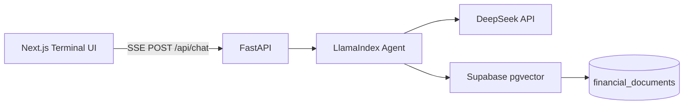

# Finsight Dashboard

Portfolio-grade **Financial Research AI Agent** — a monorepo with a Next.js 14 terminal UI, FastAPI backend, LlamaIndex RAG, DeepSeek LLM, and Supabase pgvector.

   

## Architecture



## Project Structure

```
├── app/                    # Next.js App Router pages
├── components/             # Shadcn/ui + chat & layout components
├── lib/                    # API client, session storage
├── backend/
│   ├── agent.py            # LlamaIndex RAG + streaming
│   ├── config.py           # Environment settings
│   ├── database.py         # Supabase client
│   ├── main.py             # FastAPI + SSE endpoints
│   ├── requirements.txt
│   └── supabase_schema.sql
├── package.json
└── README.md
```

## Prerequisites

- Node.js 18+
- Python 3.10+
- [Supabase](https://supabase.com) project with SQL access
- [DeepSeek](https://platform.deepseek.com) API key

## 1. Database Setup

In the Supabase SQL Editor, run the full script:

```bash
backend/supabase_schema.sql
```

This enables `pgvector`, creates `financial_documents`, and adds the `match_financial_documents` RPC for retrieval.

## 2. Backend Setup

```powershell
cd backend
python -m venv venv
.\venv\Scripts\activate
pip install -r requirements.txt
copy .env.example .env
# Edit .env with your keys
uvicorn main:app --reload --host 0.0.0.0 --port 8000
```

### Environment Variables (`backend/.env`)

| Variable | Description |
|----------|-------------|
| `DEEPSEEK_API_KEY` | DeepSeek API key |
| `DEEPSEEK_BASE_URL` | `https://api.deepseek.com` |
| `DEEPSEEK_MODEL` | e.g. `deepseek-chat` (use your DeepSeek model id) |
| `SUPABASE_URL` | Project URL |
| `SUPABASE_SERVICE_ROLE_KEY` | Service role key (server-side only) |
| `EMBEDDING_MODEL` | OpenAI-compatible embedding model id |
| `CORS_ORIGINS` | `http://localhost:3000` |

> **Embeddings:** DeepSeek is used for chat. Embeddings use the OpenAI-compatible client pointed at `DEEPSEEK_BASE_URL`. If your key does not support embeddings, set a separate OpenAI key by extending `config.py` or use an embedding provider supported by LlamaIndex.

## 3. Frontend Setup

```powershell
cd ..
npm install
copy .env.local.example .env.local
npm run dev
```

Open [http://localhost:3000](http://localhost:3000).

## Demo Flow (Portfolio Video)

1. Start backend (`uvicorn`) and frontend (`npm run dev`).
2. Click **Load Demo Corpus** in the sidebar — ingests AAPL, MSFT, NVDA, JPM, and FOMC sample filings.
3. Ask: *"Compare AAPL vs MSFT revenue growth and margins in a markdown table."*
4. Watch SSE tokens stream with source citations (ticker, filing, similarity score).

## API Endpoints

| Method | Path | Description |
|--------|------|-------------|
| `GET` | `/health` | Health check |
| `POST` | `/api/chat` | SSE streaming chat (`query`, `session_id`) |
| `POST` | `/api/ingest` | Ingest documents (`use_demo: true` or custom `documents`) |
| `POST` | `/api/reset` | Clear server-side chat memory for a session |

### SSE Event Format

```json
data: {"type": "token", "content": "partial text"}
data: {"type": "done", "sources": [{"ticker": "AAPL", "source": "10-K", "score": 0.82}]}
data: {"type": "error", "message": "..."}
```

## Production Notes

- Never expose `SUPABASE_SERVICE_ROLE_KEY` to the browser.
- Enable RLS on `financial_documents` if exposing Supabase directly.
- Use `gunicorn` + `uvicorn` workers behind a reverse proxy for deploy.
- Set `NEXT_PUBLIC_API_URL` to your deployed API origin.

## License

MIT — built for portfolio demonstration.
