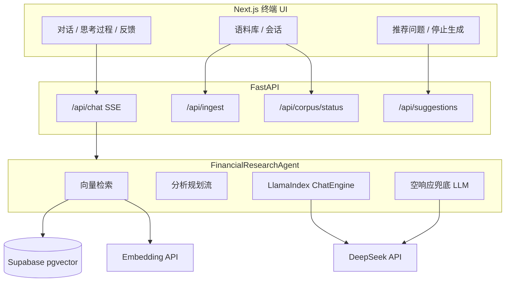

# Finsight Dashboard

面向学习与面试作品集打造的 **金融文档 RAG 研究智能体** 全栈项目 —— Next.js 14 终端风格中文界面、FastAPI 后端、LlamaIndex RAG、DeepSeek 大模型与 Supabase pgvector 向量检索。

   

## 核心能力

| 能力 | 说明 |
|------|------|
| **RAG 问答** | 基于 Supabase pgvector 检索财报/宏观语料，Condense+Context 多轮对话 |
| **思考过程** | 流式展示「检索命中 → 分析规划」后再输出正文 |
| **引用溯源** | 回答底部标注 ticker、来源文档、相似度分数 |
| **语料管理** | 从 `demo_corpus.json` 一键注入向量库，支持清空后重导 |
| **智能推荐问** | 根据语料库由 AI 生成快捷提问（会话级缓存，可手动刷新） |
| **交互增强** | 流式输出、停止生成、多会话、回答点赞/点踩 |
| **空检索兜底** | 无匹配上下文或框架空响应时，直连 LLM 给出中文说明（含日期、拒答预测类问题） |

> **定位说明：** 本项目为 **投研文档问答 Demo**，语料为演示数据，非实时行情或投资建议系统。

## 架构概览



## 项目结构

```
├── app/                      # Next.js App Router 主页面
├── components/
│   ├── chat/                 # ChatInput、ChatMessage、Markdown
│   └── layout/               # Sidebar（语料库 / 会话）
├── lib/
│   ├── api.ts                # SSE、语料、推荐问题 API 客户端
│   └── sessions.ts           # 会话与消息 localStorage
├── backend/
│   ├── agent.py              # RAG Agent、思考流、兜底逻辑
│   ├── corpus.py             # 语料 JSON 加载与校验
│   ├── data/
│   │   ├── demo_corpus.json  # 演示财报/宏观语料（可编辑）
│   │   └── README.md         # 语料格式说明
│   ├── config.py
│   ├── database.py           # Supabase + pgvector RPC
│   ├── embeddings.py
│   ├── llm.py                # DeepSeek OpenAI 兼容封装
│   ├── main.py               # FastAPI 路由
│   ├── requirements.txt
│   └── supabase_schema.sql
├── package.json
└── README.md
```

## 前端界面

| 区域 | 说明 |
|------|------|
| **侧边栏** | 新建研究、加载演示语料库（含导入结果提示）、会话历史、语料库状态（条数 / 标的） |
| **主面板** | 分析师提问 + Finsight 智能体回复，可折叠「思考过程」 |
| **回答区** | Markdown 渲染、引用来源标签、点赞/点踩反馈 |
| **输入区** | AI 推荐快捷问题、刷新按钮、流式发送 / **停止生成**（方块按钮） |
| **状态栏** | 就绪 / 思考中 / 生成回答 / 导入语料库 等 |

## 环境要求

- Node.js 18+
- Python 3.10+
- [Supabase](https://supabase.com) 项目（需 SQL 访问权限）
- [DeepSeek](https://platform.deepseek.com) API Key
- OpenAI 兼容 **Embedding** 服务（见 `.env` 配置，可与 DeepSeek 分离）

## 快速开始

### 1. 数据库初始化

在 Supabase SQL Editor 中执行：

```
backend/supabase_schema.sql
```

将启用 `pgvector`、创建 `financial_documents` 表及 `match_financial_documents` RPC。

### 2. 后端

```powershell
cd backend
python -m venv venv
.\venv\Scripts\activate
pip install -r requirements.txt
copy .env.example .env
# 编辑 .env 填入密钥
uvicorn main:app --reload --host 0.0.0.0 --port 8000
```

### 3. 前端

```powershell
cd ..
npm install
copy .env.local.example .env.local
npm run dev
```

浏览器访问 [http://localhost:3000](http://localhost:3000)。

### 环境变量

**`backend/.env`**

| 变量 | 说明 |
|------|------|
| `DEEPSEEK_API_KEY` | DeepSeek API Key |
| `DEEPSEEK_BASE_URL` | 默认 `https://api.deepseek.com` |
| `DEEPSEEK_MODEL` | 如 `deepseek-chat`、`deepseek-v4-pro` |
| `DEEPSEEK_CONTEXT_WINDOW` | 上下文窗口（可选） |
| `SUPABASE_URL` | Supabase 项目 URL |
| `SUPABASE_SERVICE_ROLE_KEY` | Service Role Key（**仅服务端**） |
| `EMBEDDING_API_KEY` | Embedding 服务 Key |
| `EMBEDDING_BASE_URL` | OpenAI 兼容 Embedding 基址 |
| `EMBEDDING_MODEL` | 如 `text-embedding-3-small`、`BAAI/bge-m3` |
| `EMBEDDING_DIMENSIONS` | 须与 `supabase_schema.sql` 中 vector 维度一致（默认 1024） |
| `CORS_ORIGINS` | `http://localhost:3000` |

**`.env.local`（前端）**

| 变量 | 说明 |
|------|------|
| `NEXT_PUBLIC_API_URL` | 默认 `http://localhost:8000` |

> **Embedding 说明：** 对话走 DeepSeek；向量嵌入使用独立 OpenAI 兼容端点（如 SiliconFlow）。若维度与库表不一致，需同步修改 SQL 与 `EMBEDDING_DIMENSIONS`。

## 演示语料库

演示数据位于 [`backend/data/demo_corpus.json`](backend/data/demo_corpus.json)，当前包含 **8 条** 文档：

`AAPL` · `MSFT` · `NVDA` · `GOOGL` · `AMZN` · `TSLA` · `JPM` · `MACRO`（FOMC）

扩展语料格式见 [`backend/data/README.md`](backend/data/README.md)。

## 演示流程（作品集录屏参考）

1. 启动后端 `uvicorn` 与前端 `npm run dev`（避免开发时频繁保存 `agent.py` 导致请求被热重载打断）。
2. 侧边栏点击 **「加载演示语料库」**，确认底部语料状态为「已存 8 条」。
3. 点击推荐问题或输入：*「对比 AAPL 与 MSFT 营收增速及利润率，并以 Markdown 表格输出。」*
4. 观察 **思考过程** → **正文流式输出** → **引用来源**。
5. 可选：演示 **停止生成**、**点赞/点踩**、**刷新推荐问题**。

### 示例问题

- 对比 AAPL 与 MSFT 营收增速及利润率
- 汇总 NVDA 数据中心业务前景（基于公告/财报）
- 最新 FOMC 对 2025 年降息路径释放何种信号？
- 生成超大盘科技 KPI 对比 Markdown 表格

## API 接口

| 方法 | 路径 | 说明 |
|------|------|------|
| `GET` | `/health` | 健康检查 |
| `POST` | `/api/chat` | SSE 流式对话（`query`, `session_id`） |
| `POST` | `/api/suggestions` | AI 推荐提问（`recent_queries`, `count`） |
| `GET` | `/api/corpus/status` | 向量库条数、演示文件元信息 |
| `POST` | `/api/ingest` | 导入文档（`use_demo`, `replace`, 或 `documents`） |
| `POST` | `/api/reset` | 清除指定会话的服务端对话记忆 |

### `POST /api/ingest` 示例

```json
{
  "use_demo": true,
  "replace": true
}
```

响应示例：

```json
{
  "ingested_nodes": 8,
  "stored_count": 8,
  "status": "success",
  "replaced": true
}
```

### SSE 事件格式

```text
data: {"type": "thinking", "content": "**知识库检索：** ..."}
data: {"type": "token", "content": "部分正文"}
data: {"type": "done", "sources": [{"ticker": "AAPL", "source": "10-K FY2024", "score": 0.82}]}
data: {"type": "error", "message": "..."}
```

| `type` | 含义 |
|--------|------|
| `thinking` | 思考过程增量（检索摘要 + 分析规划） |
| `token` | 正式回答正文增量 |
| `done` | 流结束，附带 `sources` |
| `error` | 错误信息 |

## 常见问题

### 回答显示 `Empty Response`

多因 LlamaIndex 在 **无可用检索上下文** 时返回占位符。当前版本已：

- 放宽检索策略，移除过严的相似度过滤；
- 对空正文走 **兜底 LLM**；
- 前端过滤 `Empty Response` 字面量。

若仍出现：请 **新建研究会话**、确认已加载语料库，并避免在 `uvicorn --reload` 保存文件的瞬间提问。

### 指数/股价预测类问题

演示语料 **不含实时行情**，智能体会说明无法负责任预测，并给出应关注的宏观/市场变量框架 —— 属预期行为。

### 推荐问题每次发消息都刷新

已改为 **按会话 + 语料版本缓存**；仅在进入页面、切换会话、导入语料或点击刷新按钮时重新请求。

## 生产部署注意事项

- 切勿将 `SUPABASE_SERVICE_ROLE_KEY` 暴露到浏览器。
- 为 `financial_documents` 配置 RLS（若 Supabase 对客户端开放）。
- 生产建议使用 `gunicorn` + `uvicorn` workers，置于反向代理之后。
- 设置 `NEXT_PUBLIC_API_URL` 为线上 API 地址。

## License

MIT — 仅供作品集演示与学习使用。
