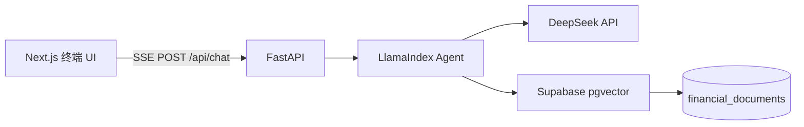

# Finsight Dashboard

面向学习与面试作品集打造的 **金融研究 AI 智能体** 全栈项目 —— 包含 Next.js 14 终端风格中文界面、FastAPI 后端、LlamaIndex RAG、DeepSeek 大模型与 Supabase pgvector 向量检索。

   

## 架构概览



## 项目结构

```
├── app/                    # Next.js App Router 页面
├── components/             # Shadcn/ui + 聊天与布局组件
│   ├── chat/               # ChatInput、ChatMessage、Markdown 渲染
│   └── layout/             # Sidebar 侧边栏
├── lib/                    # API 客户端、会话本地存储
├── backend/
│   ├── agent.py            # LlamaIndex RAG + 流式输出
│   ├── config.py           # 环境变量配置
│   ├── database.py         # Supabase 客户端
│   ├── main.py             # FastAPI + SSE 接口
│   ├── requirements.txt
│   └── supabase_schema.sql
├── package.json
└── README.md
```

## 前端界面

前端已本地化为**专业中文金融术语**，主要模块包括：

| 区域 | 说明 |
|------|------|
| 侧边栏 | 新建研究、加载演示语料库、会话历史 |
| 主面板 | 金融研究智能体对话区，SSE 流式响应 |
| 状态栏 | 就绪 / 检索上下文 / 流式响应中 / 导入语料库等状态提示 |
| 快捷提问 | 预设 AAPL/MSFT、NVDA、FOMC、KPI 表格等示例问题 |

## 环境要求

- Node.js 18+
- Python 3.10+
- [Supabase](https://supabase.com) 项目（需 SQL 访问权限）
- [DeepSeek](https://platform.deepseek.com) API Key

## 1. 数据库初始化

在 Supabase SQL Editor 中执行完整脚本：

```bash
backend/supabase_schema.sql
```

该脚本将启用 `pgvector`、创建 `financial_documents` 表，并添加用于检索的 `match_financial_documents` RPC 函数。

## 2. 后端启动

```powershell
cd backend
python -m venv venv
.\venv\Scripts\activate
pip install -r requirements.txt
copy .env.example .env
# 编辑 .env 填入你的密钥
uvicorn main:app --reload --host 0.0.0.0 --port 8000
```

### 环境变量（`backend/.env`）

| 变量 | 说明 |
|------|------|
| `DEEPSEEK_API_KEY` | DeepSeek API Key |
| `DEEPSEEK_BASE_URL` | `https://api.deepseek.com` |
| `DEEPSEEK_MODEL` | 例如 `deepseek-chat`（填写你的 DeepSeek 模型 ID） |
| `SUPABASE_URL` | Supabase 项目 URL |
| `SUPABASE_SERVICE_ROLE_KEY` | Service Role Key（仅服务端使用） |
| `EMBEDDING_MODEL` | OpenAI 兼容 Embedding 模型 ID |
| `CORS_ORIGINS` | `http://localhost:3000` |

> **Embedding 说明：** 对话使用 DeepSeek；向量嵌入通过 OpenAI 兼容客户端指向 `DEEPSEEK_BASE_URL`。若当前 Key 不支持 Embedding，可在 `config.py` 中扩展为独立 OpenAI Key，或改用 LlamaIndex 支持的其他 Embedding 提供商。

## 3. 前端启动

```powershell
cd ..
npm install
copy .env.local.example .env.local
npm run dev
```

浏览器访问 [http://localhost:3000](http://localhost:3000)。

## 演示流程（作品集录屏参考）

1. 分别启动后端（`uvicorn`）与前端（`npm run dev`）。
2. 在侧边栏点击 **「加载演示语料库」** —— 导入 AAPL、MSFT、NVDA、JPM 及 FOMC 示例公告/财报。
3. 输入示例问题，例如：*「对比 AAPL 与 MSFT 营收增速及利润率，并以 Markdown 表格输出。」*
4. 观察 SSE 流式输出，以及引用来源（股票代码、公告类型、相似度分数）。

## API 接口

| 方法 | 路径 | 说明 |
|------|------|------|
| `GET` | `/health` | 健康检查 |
| `POST` | `/api/chat` | SSE 流式对话（`query`、`session_id`） |
| `POST` | `/api/ingest` | 导入文档（`use_demo: true` 或自定义 `documents`） |
| `POST` | `/api/reset` | 清除指定会话的服务端对话记忆 |

### SSE 事件格式

```json
data: {"type": "token", "content": "partial text"}
data: {"type": "done", "sources": [{"ticker": "AAPL", "source": "10-K", "score": 0.82}]}
data: {"type": "error", "message": "..."}
```

## 生产部署注意事项

- 切勿将 `SUPABASE_SERVICE_ROLE_KEY` 暴露到浏览器端。
- 若直接对外暴露 Supabase，请为 `financial_documents` 启用 RLS。
- 生产环境建议使用 `gunicorn` + `uvicorn` workers，并置于反向代理之后。
- 部署时将 `NEXT_PUBLIC_API_URL` 设置为线上 API 地址。

## License

MIT — 仅供作品集演示与学习使用。
